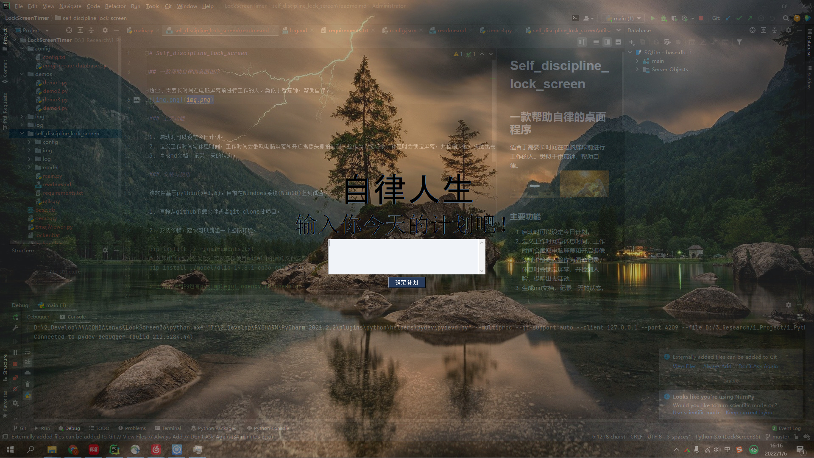

# Self_discipline_lock_screen

## 一款帮助自律的桌面程序

适合于需要长时间在电脑屏幕前进行工作的人。类似于番茄钟，帮助自律，卷就完了。



### 主要功能

1. 启动时,先是叫醒服务，自动发消息轰炸起床，结合手环效果还可以，起床来到屏幕前结束消息发送
2. 之后设定今日计划。
3. 定义工作时间与休息时间，工作时间会截取电脑屏幕和开启摄像头抓拍检测人脸作为图像记录，休息时会锁定屏幕，并检测人脸，提醒出去活动。
4. 生成md文档，记录一天的状态。
5. 结束一天后会有一个总结
6. 每天固定时长的游戏时间，会检查游戏进程，时间到了会结束游戏进程，并且无法再启动，直到第二天。
7. `pyauto.py`包含了一个自动化的程序，可以记录鼠标键盘操作，然后执行自动化操作，

### 安装与使用

该软件基于python(>=3.6)，目前在Windows系统(Win10)上测试通过。

1. 直接从github下载文件或者git clone此项目。

2. 安装依赖，建议可以新建一个虚拟环境。
```
pip install -r requirements.txt
# 如果dlib包安装失败，可以直接使用model中的whl文件安装
pip install ./model/dlib-19.8.1-cp36-cp36m-win_amd64.whl
```
> 主要的使用的包有pysimplegui,opencv,APScheduler

3. 设置一下计划
   1. title: 程序名称，可改为激励自己的名言。
   2. time_intervals: 工作时间定义，小时：分钟：秒。一行为一个工作时间段，两个工作时间段之间为休息时间，请按照规则来设定
   3. reminder: 提醒工作的提示语，可以语音播报。
   4. reminder_rest: 提醒休息的提示语，可以语音播报。
   5. interval: 多少分钟抓拍一次摄像头，记录工作状态。
```json
{
  "start_title":"自律人生", // 程序名称，可改为激励自己的名言。
  "start_tips":"输入今天的计划吧", // 程序名称，可改为激励自己的名言。
  "end_title":"完成任务！", // 程序名称，可改为激励自己的名言。
  "end_tips":"输入今天的心得吧", // 程序名称，可改为激励自己的名言。
  "time_intervals": [ //工作时间定义，小时：分钟：秒。一行为一个工作时间段，两个工作时间段之间为休息时间，请按照规则来设定
    ["09:00:00","09:50:00"],
    ["10:00:00","10:50:00"],
    ["11:00:00","11:50:00"],

    ["13:30:00","14:20:00"],
    ["14:30:00","15:20:00"],
    ["15:30:00","16:20:00"],
    ["16:30:00","17:20:00"],

    ["19:00:00","19:50:00"],
    ["20:00:00","20:50:00"],
    ["21:00:00","21:50:00"]
  ],
  "is_reminder": "0",   // 是否输出语音
  "reminder": "抓紧来学习啦！",    // 提醒工作的提示语，可以语音播报。
  "reminder_rest": "离开座位,出去休息一下吧!",   // 提醒休息的提示语，可以语音播报。
  "interval": 5,  // 多少分钟抓拍一次摄像头，记录工作状态。
  "games_name": ["notepad++.exe","vpp.exe"],  // 游戏进程名，在任务管理器中可以查到
  "games_time": 6   // 游戏时长 单位分钟
}
```
> 这里设定的是一天的计划，不能跨天，第二天需要重新启动程序
> 不是真正的锁屏，是置顶gui。自律还是要靠自己

4. 对于windows系统，可以将start.bat，建立快捷方式，添加到你的开机启动文件夹`C:\ProgramData\Microsoft\Windows\Start Menu\Programs\StartUp`中，实现开机启动。
> start.bat 里面的内容需要按自己的路径修改。

### TODO
1. 生成release安装包
2. 多屏幕，更好的自定义计划等
3. 优化代码，内存增加问题
4. `pyauto.py` 很多功能都有待完善，目前只可以进行简单的记录点击等，有很多bug,可以参考按键精灵，与之不同的是，做的是图片匹配，而不是简单的坐标（目前还没完成）

### 说明
代码有比较详细的注释，由于本人科研任务繁重，暂时不会更新，如果感兴趣可以提交request，欢迎star，有问题可以发邮件给我。

开发这个软件初衷是因为导师放养，整体待在家里，导致每天打游戏，惭愧惭愧，所以写了个软件，也算是监督自己吧，不然要毕不了业了:trollface: 


